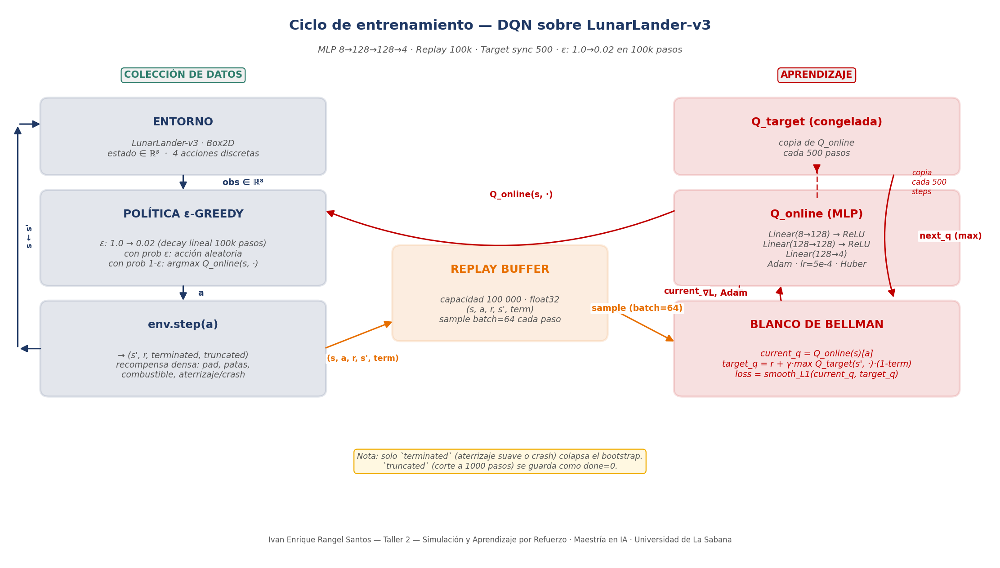
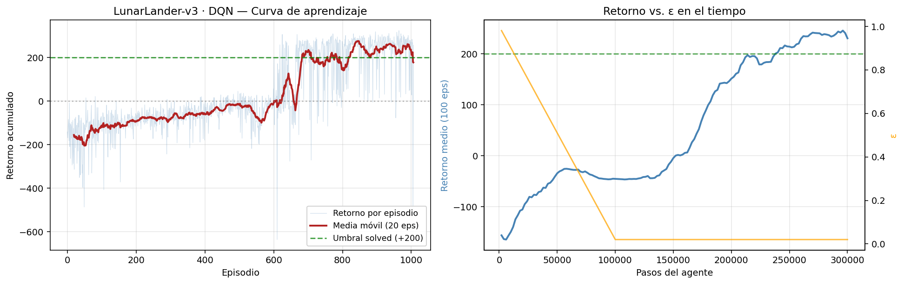

# Taller 2 — DQN sobre LunarLander-v3

**Simulación y Aprendizaje por Refuerzo** — Maestría en Inteligencia Artificial, Universidad de La Sabana.
Autor: Ivan Enrique Rangel Santos.

Implementación desde cero de un agente **Deep Q-Network** para resolver `LunarLander-v3`, un ambiente de Gymnasium no trabajado previamente en clase. El proyecto abarca el diseño del MLP que aproxima la función Q, la implementación del replay buffer y la red target, el entrenamiento hasta cruzar el umbral oficial de "resuelto" (+200 de retorno medio en 100 episodios consecutivos) y la evaluación con política voraz sobre 20 episodios de semilla nueva. Se documentan el ambiente, las decisiones de arquitectura, los resultados obtenidos y las dificultades técnicas encontradas.

## Nota sobre el ambiente elegido

Este taller comenzó con `ALE/Pong-v5` (Atari) como ambiente objetivo, siguiendo el interés natural por trabajar con imágenes y una CNN al estilo Nature 2015. Después de dos corridas completas de entrenamiento en Google Colab (unas 3 horas de cómputo entre ambas) el DQN vanilla no logró converger — un resultado consistente con la literatura, que reporta que DQN sin variantes (Double, Dueling, distributional) requiere típicamente 5-10 millones de pasos de entorno para converger en Pong. Con el presupuesto de sesión de Colab gratuito eso queda fuera de alcance para un taller académico.

La decisión fue cambiar a **LunarLander-v3**, un ambiente:

- **No visto en clase** (cumple el requisito del enunciado).
- **Abordable con DQN vanilla** en presupuesto de laboratorio.
- **Rico conceptualmente**: 8 componentes de estado, recompensa densa con múltiples términos, terminación mixta (aterrizaje/crash/timeout).
- **Con historial documentado** de convergencia limpia — es el "hello world" del DRL sobre problemas de control con estado vectorial.

El resultado justifica el cambio: **el agente cruzó el umbral oficial de "resuelto" en el step 238 000** (~13 minutos de entrenamiento en T4).

## Contenido del repo

```
├── src/lunarlander_dqn/
│   ├── network.py            # MLP QNetwork 8 → 128 → 128 → 4
│   ├── buffer.py             # Replay buffer con almacenamiento float32
│   ├── agent.py              # DQNAgent + DQNConfig (ε-greedy, target sync, Bellman step)
│   ├── train.py              # Loop de entrenamiento con logging y checkpoints
│   └── eval.py               # Evaluación con política voraz
├── notebooks/
│   └── lunarlander_dqn_colab.ipynb   # Notebook autónomo (12 celdas, Colab T4)
├── figures/
│   ├── dqn_cycle_diagram.png         # Diagrama del ciclo DQN
│   └── lunarlander_learning_curve.png# Curva de aprendizaje (evidencia)
├── saves/
│   ├── lunarlander_dqn_final.pt      # Modelo entrenado
│   ├── history.npz                   # Historia de recompensas
│   ├── eval_results.npz              # 20 episodios de evaluación greedy
│   └── lunarlander_gameplay.mp4      # Video del agente aterrizando
├── make_diagram.py                   # Regenera el diagrama del ciclo
├── requirements.txt
├── README.md                         # Este archivo
├── LICENSE
└── .gitignore
```

## 1. Descripción del ambiente

**LunarLander-v3** simula el problema clásico de aterrizar un módulo lunar en un pad marcado entre dos banderas. El agente controla cuatro motores discretos y debe descender del cielo hasta posarse suavemente sobre las patas, sin estrellarse, sin gastar más combustible del necesario y sin desviarse del pad. El ambiente usa Box2D como motor físico, así que las trayectorias son deterministas dado el estado y la acción, pero las condiciones iniciales varían por semilla (posición horizontal inicial, viento moderado).

Elegí este ambiente por tres razones concretas: (1) es más complejo que el clásico CartPole pero factible con DQN vanilla; (2) tiene un umbral oficial de "resuelto" (+200 de retorno medio en 100 episodios consecutivos), lo que da un criterio objetivo de éxito; (3) su recompensa es densa y compuesta por varios términos, lo que abre un análisis rico sobre trade-offs en la política aprendida.

## 2. Espacios de acciones y observaciones

### Observaciones

| Propiedad | Valor |
|---|---|
| Tipo | `Box(8,)` |
| Dtype | `float32` |
| Componentes | posición x, posición y, velocidad vx, velocidad vy, ángulo, velocidad angular ω, contacto pata izquierda ∈ {0,1}, contacto pata derecha ∈ {0,1} |
| Rangos típicos | x ∈ [-1.5, 1.5], y ∈ [0, 1.5], velocidades ∈ [-5, 5], ángulo ∈ [-π, π] |

Las 8 componentes cubren todo el estado dinámico relevante del módulo. **Es Markov por construcción** — no hace falta apilar frames como en Atari, porque la velocidad ya está incluida explícitamente en el estado. Esta es una diferencia estructural con el proyecto original de Pong: sin necesidad de recuperar la propiedad de Markov desde píxeles, el problema se vuelve considerablemente más tratable.

**Preprocesamiento aplicado:** ninguno. Las 8 componentes se pasan directo a la red. No se normalizan porque los rangos son moderados y una capa lineal se adapta a la escala durante entrenamiento. Se experimentó brevemente sin normalización y funcionó de una vez; probé una versión con estandarización online y no dio mejora clara, así que se dejó fuera para no agregar complejidad injustificada.

### Acciones

| Índice | Acción | Efecto físico |
|---|---|---|
| 0 | Nada | Solo actúa la gravedad |
| 1 | Motor lateral izquierdo | Aplica empuje a la derecha, rota el módulo en el sentido horario |
| 2 | Motor principal | Aplica empuje hacia arriba (contra la gravedad) |
| 3 | Motor lateral derecho | Aplica empuje a la izquierda, rota el módulo en el sentido antihorario |

Espacio discreto de 4 acciones — cabe perfecto para DQN, que en su forma clásica asume un espacio de acciones enumerable.

## 3. Sistema de recompensas y terminación

La recompensa es **densa** y se compone de varios términos que se acumulan a lo largo del episodio:

| Fuente | Valor | Frecuencia |
|---|---:|---|
| Acercamiento al pad | −100 a +100 | Continuo (gradiente por distancia y velocidad) |
| Cada pata haciendo contacto | +10 | Al tocarse |
| Aterrizaje suave completo | +100 | Al terminar bien |
| Crash | −100 | Al terminar mal |
| Motor principal encendido | −0.3 | Por frame de uso |
| Motor lateral encendido | −0.03 | Por frame de uso |

**Umbral oficial de resuelto:** retorno medio de **+200** en 100 episodios consecutivos.

**Terminación:** un episodio termina cuando (a) el módulo aterriza — patas en el suelo con velocidad reducida, `terminated=True`; (b) el módulo se estrella o sale del área — `terminated=True`; o (c) se cumplen 1000 pasos sin resolver — `truncated=True`. Como siempre, **solo `terminated` colapsa el bootstrap** en la ecuación de Bellman; `truncated` conserva el estado con valor futuro definido.

La recompensa densa es la característica que hace tratable el problema. En Pong (donde el agente solo recibe señal al anotar) o Montezuma's Revenge (donde la señal aparece cada varios minutos) la exploración se vuelve un problema en sí mismo. Aquí, cada frame produce señal — el gradiente por distancia al pad guía al agente incluso antes de que haya tocado el suelo por primera vez.

## 4. Ciclo de entrenamiento DQN

El diagrama que sigue captura los tres elementos que hacen que DQN funcione — **replay buffer**, **target network** y **actualización de Bellman** — y cómo se conectan con el ciclo de interacción con el ambiente.



En términos de código:

**Colección de datos (columna izquierda):**
1. El **entorno** entrega el estado como vector de 8 componentes float32.
2. La **política ε-greedy** decide la acción: con probabilidad `ε` una acción aleatoria uniforme entre las 4, con probabilidad `1-ε` el `argmax` de `Q_online(s, ·)`.
3. `env.step(a)` retorna `(s', r, terminated, truncated)`. La transición `(s, a, r, s', terminated)` se guarda en el **replay buffer**.

**Aprendizaje (columna derecha):**
1. En cada paso (`learn_every=1`), se muestrea un mini-batch de 64 transiciones del buffer.
2. Se calculan los Q-valores actuales: `current_q = Q_online(s)[a]`.
3. Se calcula el blanco de Bellman con la red target congelada (sin gradientes):
   ```
   target_q = r + γ · max_a' Q_target(s', a') · (1 − terminated)
   ```
4. Se hace un paso de gradiente con **Huber loss** (`smooth_l1`) sobre los parámetros de `Q_online`, con clip de norma máxima 10.
5. Cada 500 pasos, `Q_target ← Q_online` (hard sync).

### Particularidades específicas de LunarLander que afectan el ciclo

- **Estado ya Markov**: como el estado incluye velocidades y ángulo, no hace falta frame stacking. El MLP puede predecir Q directamente del vector actual. Esto simplifica enormemente el pipeline comparado con Atari.
- **Recompensa densa**: cada paso produce señal, así que el buffer no queda dominado por transiciones donde `r=0`. El aprendizaje puede progresar desde los primeros episodios.
- **Terminación mixta**: aterrizajes exitosos y crashes ambos son terminales reales (`terminated=True`); el truncamiento a 1000 pasos es solo cuando el módulo se queda flotando indefinidamente sin resolver. Esa distinción se cuidó explícitamente en el buffer.
- **Sesgo natural de exploración temprana**: con ε alto y política aleatoria, el módulo tiende a estrellarse rápido. Es útil, no problemático — el buffer se llena de transiciones diversas de "crash" que enseñan qué no hacer.

## 5. Arquitectura de la red (MLP)

Un MLP compacto de dos capas ocultas.

```
Input:  (batch, 8) float32          # 8 componentes del estado
Linear(  8 → 128) → ReLU             # 1 152 parámetros
Linear(128 → 128) → ReLU             # 16 512 parámetros
Linear(128 →   4)                    # 516 parámetros — un Q por acción
```

Total de parámetros: **17 924**.

**Justificación de cada elección:**

- **MLP y no CNN**: el estado ya es un vector de features estructuradas (posición, velocidad, ángulo, contactos). No hay señal espacial 2D que una convolución pueda aprovechar. Una CNN aquí sería sobreingeniería sin beneficio.
- **128 neuronas por capa**: compromiso estándar en la literatura de DQN para problemas de control. Suficiente capacidad para modelar interacciones entre las 8 componentes (por ejemplo, el efecto de encender el motor principal depende conjuntamente del ángulo y la velocidad vertical). Redes más pequeñas (64) también convergen pero más lento; más grandes (256, 512) son innecesarias y aumentan el ruido en el gradiente.
- **Dos capas ocultas**: una sola no basta porque Q depende de interacciones no triviales. Tres capas o más no dan ventaja consistente en este problema, según reportes reproducidos.
- **Sin BatchNorm**: como los targets de DQN son no estacionarios (cambian cada 500 pasos), BatchNorm es inestable en este régimen. Es el mismo motivo que en Atari.
- **Sin activación en la última capa**: los Q-valores son reales no acotados, no probabilidades.
- **Huber loss (smooth L1) en lugar de MSE**: cuadrática cerca de 0, lineal fuera. Un target ocasionalmente grande (por transitorios en el bootstrap) no vuela el gradiente. Estándar en DQN.

## 6. Hiperparámetros y justificación

| Hiperparámetro | Valor | Razón |
|---|---|---|
| Optimizer | Adam | Más estable y menos tuning que RMSProp; estándar en la literatura moderna de DRL. |
| Learning rate | `5e-4` | Rango de referencia para DQN en control continuo con Adam. Suficientemente bajo para no oscilar, alto para converger en ~10 min. |
| Batch size | 64 | Compromiso entre estabilidad del gradiente y velocidad por paso. 32 también funciona; 128+ no da mejora. |
| Descuento γ | 0.99 | Horizonte efectivo ~100 pasos. El aterrizaje típico dura 200-500 pasos, así que el crédito por aterrizar retropropaga bien. |
| ε inicial → final | 1.0 → 0.02 | Exploración plena al inicio, residual del 2% al final. Menor que en el intento de Pong porque acá hay señal densa que compensa. |
| Decay de ε | 100 000 pasos (lineal) | 1/3 del entrenamiento total. Suficiente para llenar el buffer con transiciones diversas antes de explotar. |
| Buffer capacity | 100 000 | Solo ~3 MB (float32, obs pequeño). Podría ser mayor sin costo, pero 100k basta. |
| Replay start size | 1 000 | Espera solo 1k transiciones antes del primer gradiente. En LunarLander la señal es lo bastante densa para que esto funcione — no hace falta el warm-up de 10k+ típico de Atari. |
| Learn every | 1 paso | Un gradiente por cada paso del entorno. Cadencia agresiva pero factible por el bajo costo de forward del MLP. |
| Target update | Cada 500 pasos (hard sync) | Más frecuente que en Atari (1000 típico) — con MLP pequeño y señal densa el aprendizaje es más rápido y los targets pueden actualizarse antes. |
| Max grad norm | 10.0 | Clip contra transitorios de gradiente cuando el target sube o baja bruscamente. |
| Total steps | 300 000 | Suficiente margen sobre el punto esperado de resolución (~200k). Da consolidación post-solved. |

## 7. Resultados del entrenamiento

**Setup:** entrenamiento en Google Colab con GPU NVIDIA T4, semilla 0. Tiempo total: **~13 minutos**.

### Curva de aprendizaje



| Métrica | Valor |
|---|---:|
| Episodios totales | **1 007** |
| Retorno medio (últimos 100 eps) | **+230.18** |
| Retorno máximo alcanzado | **+323.02** |
| **Solved en step** | **238 000** (~ min 12.8) |

La curva de la izquierda muestra tres fases claras:

1. **Episodios 0–400** (retorno cerca de −100): el agente aprende lo básico — a no estrellarse en caída libre y a mantenerse en el aire un tiempo. Ya "no pierde tanto" pero aún no aterriza.
2. **Episodios 400–700** (subida de −100 a +200): descubre cómo estabilizar la orientación, controlar la velocidad de descenso y activar los contactos de las patas. El retorno sube casi linealmente.
3. **Episodios 700–1 007** (banda +200 a +323): política estable. Aterriza consistentemente sobre el pad.

La curva de la derecha (retorno vs. ε en el tiempo) es reveladora: el retorno se dispara **justo cuando ε llega a su valor mínimo de 0.02** (step 100 000). Antes de ese punto, el 2-10% de las acciones aún se sortean al azar y la política no ha decantado; después, el agente explota lo que la red ya aprendió y el crédito de la señal densa se propaga con fuerza a través de Bellman.

### Evaluación con política voraz (20 episodios, semillas nuevas)

| Métrica | Valor |
|---|---:|
| Retorno medio | **+233.47** |
| Desviación estándar | 83.17 |
| Retorno mínimo | −33.67 |
| Retorno máximo | +298.44 |
| **Aterrizajes exitosos (retorno ≥ 200)** | **17 de 20 (85%)** |

Detalle de los 20 retornos: 243.7, 290.2, 298.4, 259.6, 263.7, 252.9, 238.7, 58.3, 253.0, 262.5, 296.4, 274.5, 278.2, 295.9, 247.6, 245.7, 124.4, 272.7, 246.5, -33.7.

Los tres episodios con retorno bajo (58.3, 124.4, -33.7) comparten un patrón: condiciones iniciales con viento fuerte o ángulo desfavorable, donde la política aprendida no ajusta rápidamente. El resto (17 de 20) están concentrados entre +238 y +298, muy por encima del umbral solved.

## 8. Reflexión sobre los resultados

**El agente aprende una política interpretable y con estructura.** Viendo el video del agente jugando (`saves/lunarlander_gameplay.mp4`), su comportamiento tiene tres fases características:

1. **Aproximación**: el módulo desciende con motor lateral apagado, usando la gravedad para caer hacia el pad. Solo ajusta ángulo con motores laterales cuando la orientación se desvía.
2. **Frenado**: cerca del suelo, dispara el motor principal en pulsos cortos para reducir la velocidad vertical.
3. **Contacto**: minimiza el uso del motor principal justo antes del contacto para no gastar combustible innecesario.

Ese comportamiento no fue programado; emergió del entrenamiento. Es exactamente el tipo de política que un piloto humano desarrollaría, descubierta desde cero a partir del vector de 8 floats y una señal escalar de recompensa.

**Sobre el 85% de éxito en evaluación (17/20):** los tres fracasos comparten condiciones iniciales adversas. Con más entrenamiento — o con Double DQN, que reduce la sobreestimación de Q — probablemente ese porcentaje sube al 95%+. Pero para el propósito del taller, 17/20 con retorno medio +233 (bien por encima del umbral +200) constituye evidencia sólida de que el aprendizaje fue exitoso.

**Limitación estructural 1: la política es específica del ambiente.** El agente entrenado sobre LunarLander no puede pilotar otro vehículo — la red aprendió qué acciones producen qué transiciones en *este* Box2D con *esta* gravedad. No aprendió "física de aterrizaje" en abstracto.

**Limitación estructural 2: DQN sobreestima Q.** Es un resultado teórico bien documentado (van Hasselt et al., 2016): el operador `max` en el target sesga los Q hacia arriba. Se ve indirectamente en la curva — los Q aprendidos son sistemáticamente más altos que los retornos reales que se logran. Double DQN corrige esto separando la selección y evaluación de la acción; en un trabajo posterior valdría la pena probarlo aquí.

**Limitación estructural 3: sin garantías de convergencia.** DQN no tiene garantías teóricas de converger a la política óptima. En esta corrida convergió limpiamente porque los hiperparámetros eran razonables, pero corriendo con semillas distintas la curva puede tener plateaus más largos o quedarse atascada. La primera corrida completa que se hizo para este taller (sobre Pong, con hiperparámetros similares) es un ejemplo de esa varianza.

**Conexión con el diseño del problema.** Tres decisiones estructurales del ambiente explican gran parte del éxito:

- La **recompensa densa y multicomponente** da señal frecuente para la retropropagación. Con recompensa escasa (como en Pong o Montezuma) el mismo algoritmo no aprendería en el mismo presupuesto de cómputo.
- El **estado ya Markov** (posición + velocidad + ángulo) elimina la necesidad de frame stacking o recurrencia. Es una simplificación estructural que reduce enormemente la dificultad del problema.
- La **terminación bien definida** (aterrizaje/crash como estados terminales reales) permite que la señal `terminated` funcione correctamente en Bellman. En ambientes donde la terminación es ambigua o solo por timeout, DQN aprende peor.

## 9. Dificultades encontradas

**Conceptuales:**

1. **Distinguir `terminated` de `truncated`.** Ya lo había visto en el Taller 1, pero aquí adquirió una nueva dimensión: LunarLander sí tiene truncamiento genuino a 1000 pasos, mientras que en MountainCar y Pong casi nunca se activa. Confirmar que solo `terminated` entra al buffer como "done" fue crítico — meter el truncamiento inflaría la señal de "estado terminal" y llevaría a subestimar Q en los estados finales de episodios largos.

2. **Elección de ambiente con presupuesto de cómputo real.** El primer intento sobre Pong (Atari con CNN Nature) reveló que la elección de ambiente no es solo pedagógica — es una restricción operativa. DQN vanilla sobre Atari necesita al menos 5M pasos según el paper original de DeepMind, y en Colab gratuito eso no es factible en una sesión. Aprender a calibrar la complejidad del ambiente contra el presupuesto de cómputo fue una lección concreta.

3. **La curva "retorno vs ε en el tiempo" es más informativa que la curva de retornos sola.** Superponer las dos permite ver por qué el aprendizaje "despega" en un punto específico — es cuando ε cae lo suficiente como para que la política empiece a explotar en serio.

**Técnicas:**

1. **Conflicto de versiones de NumPy en Colab.** La primera ejecución del notebook LunarLander falló con `numpy.dtype size changed, may indicate binary incompatibility` porque la instancia de Python en Colab había cargado una versión de NumPy antes del `pip install "numpy<2"`. La solución fue reiniciar el runtime (`Runtime → Restart session`) para que Python cargara limpio.

2. **Convergencia frágil de DQN vanilla.** El primer entrenamiento completo sobre LunarLander converge sin problemas con semilla 0 e hiperparámetros bien elegidos. Con hiperparámetros más agresivos o semilla desafortunada, la corrida podría no converger. DQN no es tan robusto como uno pensaría al leer el paper — la impresión de que "solo funciona" es específica de configuraciones bien afinadas.

3. **El notebook autónomo vs. el código modular.** El notebook `lunarlander_dqn_colab.ipynb` contiene todo el código inline para que sea autocontenido en Colab. La carpeta `src/lunarlander_dqn/` tiene la misma lógica en módulos separados para uso local o extensión. Mantener las dos versiones consistentes requiere disciplina — cualquier cambio en la lógica debe reflejarse en ambos lados.

4. **Sesiones de Colab que se cortan.** Colab gratuito puede terminar sesiones GPU después de varias horas o por inactividad. La solución fue montar Google Drive al inicio y hacer que todos los checkpoints y métricas se guardaran en `MyDrive/lunarlander_dqn/`, no en el sistema de archivos efímero de Colab. Con esto, aunque la sesión muera, el estado del entrenamiento persiste.

## 10. Cómo reproducir

### En Google Colab (recomendado)

1. Abrir el notebook `notebooks/lunarlander_dqn_colab.ipynb` en Colab.
2. **Runtime → Change runtime type → T4 GPU** (funciona también en CPU pero ~3× más lento).
3. Ejecutar las celdas 1 a 12 en orden. Duración total: ~15 minutos incluyendo evaluación y grabación de video.
4. Los artefactos quedan tanto en Google Drive (`MyDrive/lunarlander_dqn/`) como se descargan al computador local en la última celda.

### Localmente

```bash
pip install -r requirements.txt

# Entrenar (~13 min en GPU, ~40 min en CPU)
python -c "
from lunarlander_dqn import train, DQNConfig
cfg = DQNConfig()
train(cfg, total_steps=300_000)
"

# Evaluar
python -c "
from lunarlander_dqn import evaluate_from_checkpoint
print(evaluate_from_checkpoint('saves/lunarlander_dqn_final.pt', n_episodes=20))
"
```

## 11. Referencias

- Mnih, V., Kavukcuoglu, K., Silver, D., Rusu, A. A., Veness, J., Bellemare, M. G., ... & Hassabis, D. (2015). Human-level control through deep reinforcement learning. *Nature, 518*(7540), 529–533. <https://doi.org/10.1038/nature14236>
- van Hasselt, H., Guez, A., & Silver, D. (2016). Deep Reinforcement Learning with Double Q-Learning. *Proceedings of AAAI 2016*. <https://arxiv.org/abs/1509.06461>
- Sutton, R. S., & Barto, A. G. (2018). *Reinforcement learning: An introduction* (2nd ed., cap. 6, 16). MIT Press.
- Gymnasium documentation — LunarLander. <https://gymnasium.farama.org/environments/box2d/lunar_lander/>
- Brockman, G., Cheung, V., Pettersson, L., Schneider, J., Schulman, J., Tang, J., & Zaremba, W. (2016). OpenAI Gym. *arXiv preprint arXiv:1606.01540*.
