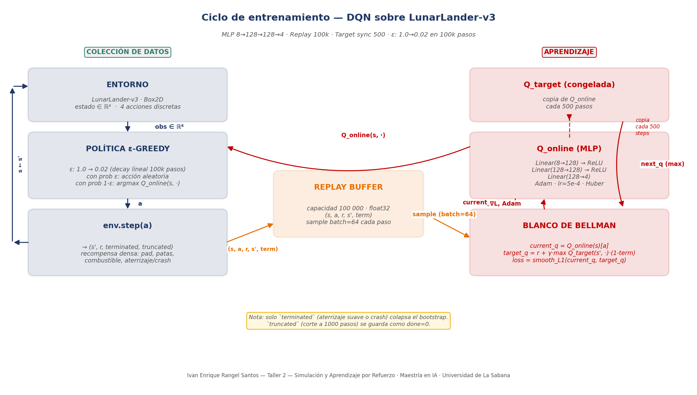
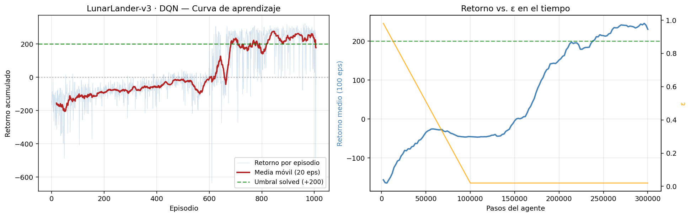

# Taller 2  DQN sobre LunarLander v3

**Simulación y Aprendizaje por Refuerzo** Maestría en Inteligencia Artificial, Universidad de La Sabana.
Autor: Ivan Enrique Rangel Santos.

En este proyecto desarrollé desde cero un agente Deep Q-Network (DQN) para resolver el entorno LunarLander-v3 de Gymnasium. Durante el desarrollo implementé la red neuronal tipo MLP para aproximar la función Q, el replay buffer y la red target, que son componentes importantes para que el agente pueda aprender de las experiencias obtenidas durante el entrenamiento.

El objetivo fue entrenar el agente hasta alcanzar el criterio establecido para considerar el entorno como resuelto, es decir, obtener un retorno promedio superior a +200 durante 100 episodios consecutivos. Después de lograrlo, evalué el comportamiento del agente utilizando una política voraz en 20 episodios con nuevas semillas, para comprobar cómo respondía ante situaciones diferentes a las utilizadas durante el entrenamiento.

También documenté las características principales del entorno, las decisiones que tomé para definir la arquitectura de la red y los parámetros utilizados durante el entrenamiento. Finalmente, incluí los resultados obtenidos y las principales dificultades técnicas que encontré durante la implementación, junto con la forma en que fui solucionándolas.

## Nota sobre el ambiente elegido

El taller inicialmente lo planteé utilizando ALE/Pong-v5 de Atari, porque me parecía interesante trabajar con imágenes y aplicar una CNN siguiendo el enfoque presentado en Nature en 2015. Sin embargo, después de realizar dos entrenamientos completos en Google Colab, que representaron aproximadamente 3 horas de tiempo de cómputo entre las dos pruebas, observé que el DQN vanilla no lograba converger.

La decisión fue cambiar a **LunarLander-v3**, un ambiente:

- **Abordable con DQN vanilla** en presupuesto de laboratorio.
- **Rico conceptualmente**: 8 componentes de estado, recompensa densa con múltiples términos, terminación mixta (aterrizaje/crash/timeout).
- **Con historial documentado** de convergencia limpia  es el "hello world" del DRL sobre problemas de control con estado vectorial.

El resultado confirmó que el cambio de entorno fue una buena decisión, ya que el agente logró superar el umbral oficial de “resuelto” en el step 238.000, después de aproximadamente 13 minutos de entrenamiento utilizando una GPU T4.
## Contenido del ejercicio

```
├── src/lunarlander_dqn/
│   ├── network.py            # MLP QNetwork 8 → 128 → 128 → 4
│   ├── buffer.py             # Replay buffer con almacenamiento float32
│   ├── agent.py              # DQNAgent + DQNConfig (ε-greedy, target sync, Bellman step)
│   ├── train.py              # Loop de entrenamiento con logging y checkpoints
│   └── eval.py               # Evaluación con política voraz
├── notebooks/
│   └── lunarlander_dqn_colab.ipynb   # Notebook autónomo (12 celdas, Colab T4)
├── figures/
│   ├── dqn_cycle_diagram.png         # Diagrama del ciclo DQN
│   └── lunarlander_learning_curve.png# Curva de aprendizaje (evidencia)
├── saves/
│   ├── lunarlander_dqn_final.pt      # Modelo entrenado
│   ├── history.npz                   # Historia de recompensas
│   ├── eval_results.npz              # 20 episodios de evaluación greedy
│   └── lunarlander_gameplay.mp4      # Video del agente aterrizando
├── make_diagram.py                   # Regenera el diagrama del ciclo
├── requirements.txt
├── README.md                         # Este archivo
├── LICENSE
└── .gitignore
```

## 1. Descripción del ambiente

**LunarLander-v3** El ambiente simula el problema clásico de aterrizar un módulo lunar en un punto específico ubicado entre dos banderas. El agente tiene el control de cuatro acciones relacionadas con los motores y debe lograr que el módulo descienda y aterrice suavemente sobre las patas, evitando estrellarse, tratando de no gastar combustible innecesariamente y manteniéndose dentro de la zona de aterrizaje.

Para simular la dinámica del módulo se utiliza Box2D como motor físico. Esto significa que, dadas las mismas condiciones iniciales, el comportamiento del ambiente es determinista frente a las acciones que toma el agente. Sin embargo, las condiciones iniciales pueden cambiar dependiendo de la semilla utilizada, por ejemplo, la posición horizontal inicial y la presencia de un viento moderado.

Elegí este ambiente principalmente por tres razones. Primero, porque representa un reto mayor que un ambiente sencillo como CartPole, pero todavía es posible abordarlo utilizando un DQN vanilla. Segundo, porque cuenta con un criterio oficial para determinar cuándo el agente ha logrado resolver el problema: alcanzar un retorno medio de +200 durante 100 episodios consecutivos. Esto permite tener una medida clara y objetiva del desempeño. Finalmente, la función de recompensa es relativamente densa y está compuesta por diferentes elementos, lo que permite analizar con mayor detalle cómo el agente aprende a tomar decisiones y los diferentes compromisos que aparecen en la política aprendida.

## 2. Espacios de acciones y observaciones

### Observaciones

| Propiedad | Valor |
|---|---|
| Tipo | `Box(8,)` |
| Dtype | `float32` |
| Componentes | posición x, posición y, velocidad vx, velocidad vy, ángulo, velocidad angular ω, contacto pata izquierda ∈ {0,1}, contacto pata derecha ∈ {0,1} |
| Rangos típicos | x ∈ [-1.5, 1.5], y ∈ [0, 1.5], velocidades ∈ [-5, 5], ángulo ∈ [-π, π] |

Las 8 variables del estado contienen la información que necesitamos para saber cómo se encuentra el módulo en cada momento. Una ventaja de este ambiente es que el estado ya tiene incluida la información sobre la posición y la velocidad del módulo, por lo que cumple con la propiedad de Markov. Esto hace que no sea necesario guardar varias imágenes o juntar diferentes frames, como sí ocurre en Atari. En este caso, la velocidad ya está disponible directamente como parte del estado y el agente puede utilizarla para tomar la siguiente decisión.

Esta fue una diferencia importante frente al proyecto inicial con Pong, porque allí teníamos que obtener la información a partir de las imágenes. En LunarLander-v3, al tener directamente las variables que describen el estado del módulo, el problema se vuelve mucho más sencillo de trabajar con un DQN vanilla

**Preprocesamiento aplicado:** ninguno. Las 8 variables del estado se pasan directamente a la red neuronal. En este caso decidí no hacer una normalización, principalmente porque los valores están dentro de rangos moderados y la propia red puede ir ajustando las diferentes escalas durante el entrenamiento. Hice una prueba rápida sin normalizar y el agente funcionó desde el comienzo. También probé una versión utilizando estandarización online, pero no encontré una mejora clara en los resultados. Por eso preferí dejar esta parte por fuera y mantener el modelo más sencillo, evitando agregar una complejidad que no estaba aportando un beneficio evidente.

### Acciones

| Índice | Acción | Efecto físico |
|---|---|---|
| 0 | Nada | Solo actúa la gravedad |
| 1 | Motor lateral izquierdo | Aplica empuje a la derecha, rota el módulo en el sentido horario |
| 2 | Motor principal | Aplica empuje hacia arriba (contra la gravedad) |
| 3 | Motor lateral derecho | Aplica empuje a la izquierda, rota el módulo en el sentido antihorario |

Espacio discreto de 4 acciones — cabe perfecto para DQN, que en su forma clásica asume un espacio de acciones enumerable.

## 3. Sistema de recompensas y terminación

La recompensa que utiliza el ambiente es densa, es decir, el agente va recibiendo diferentes recompensas o penalizaciones durante el episodio, y estas se van acumulando hasta llegar al resultado final.

| Fuente | Valor | Frecuencia |
|---|---:|---|
| Acercamiento al pad | −100 a +100 | Continuo (gradiente por distancia y velocidad) |
| Cada pata haciendo contacto | +10 | Al tocarse |
| Aterrizaje suave completo | +100 | Al terminar bien |
| Crash | −100 | Al terminar mal |
| Motor principal encendido | −0.3 | Por frame de uso |
| Motor lateral encendido | −0.03 | Por frame de uso |

**Umbral oficial de resuelto:** retorno medio de **+200** en 100 episodios consecutivos.

**Terminación:** un episodio termina cuando (a) el módulo aterriza con las patas en el suelo con velocidad reducida, `terminated=True`; (b) el módulo se estrella o sale del área  `terminated=True`; o (c) se cumplen 1000 pasos sin resolver `truncated=True`. Como siempre, **solo `terminated` colapsa el bootstrap** en la ecuación de Bellman; `truncated` conserva el estado con valor futuro definido.

Para mí, una de las características más importantes de este ambiente es que la recompensa es densa, porque esto hace que el problema sea mucho más manejable para el agente. A diferencia de juegos como Pong, donde la recompensa aparece principalmente cuando se anota un punto, o Montezuma's Revenge, donde pueden pasar bastante tiempo sin recibir una señal clara, en LunarLander-v3 el agente recibe información de recompensa constantemente. Esto le permite saber si se está acercando o alejando del objetivo y ajustar sus acciones incluso antes de lograr el primer aterrizaje. Por ejemplo, la distancia al punto de aterrizaje le da una señal que ayuda al agente a aprender desde las primeras etapas del entrenamiento.

## 4. Ciclo de entrenamiento DQN

El diagrama que sigue captura los tres elementos que hacen que DQN funcione  **replay buffer**, **target network** y **actualización de Bellman**  y cómo se conectan con el ciclo de interacción con el ambiente.



En términos de código:

**Colección de datos (columna izquierda):**
1. El **entorno** entrega el estado como vector de 8 componentes float32.
2. La **política ε-greedy** decide la acción: con probabilidad `ε` una acción aleatoria uniforme entre las 4, con probabilidad `1-ε` el `argmax` de `Q_online(s, ·)`.
3. `env.step(a)` retorna `(s', r, terminated, truncated)`. La transición `(s, a, r, s', terminated)` se guarda en el **replay buffer**.

**Aprendizaje (columna derecha):**
1. En cada paso (`learn_every=1`), se muestrea un mini-batch de 64 transiciones del buffer.
2. Se calculan los Q-valores actuales: `current_q = Q_online(s)[a]`.
3. Se calcula el blanco de Bellman con la red target congelada (sin gradientes):
   ```
   target_q = r + γ · max_a' Q_target(s', a') · (1 − terminated)
   ```
4. Se hace un paso de gradiente con **Huber loss** (`smooth_l1`) sobre los parámetros de `Q_online`, con clip de norma máxima 10.
5. Cada 500 pasos, `Q_target ← Q_online` (hard sync).

### Particularidades específicas de LunarLander que afectan el ciclo

- **Estado ya Markov**: como el estado incluye velocidades y ángulo, no hace falta frame stacking. El MLP puede predecir Q directamente del vector actual. Esto simplifica enormemente el pipeline comparado con Atari.
- **Recompensa densa**: cada paso produce señal, así que el buffer no queda dominado por transiciones donde `r=0`. El aprendizaje puede progresar desde los primeros episodios.
- **Terminación mixta**: aterrizajes exitosos y crashes ambos son terminales reales (`terminated=True`); el truncamiento a 1000 pasos es solo cuando el módulo se queda flotando indefinidamente sin resolver. Esa distinción se cuidó explícitamente en el buffer.
- **Sesgo natural de exploración temprana**: con ε alto y política aleatoria, el módulo tiende a estrellarse rápido. Es útil, no problemático — el buffer se llena de transiciones diversas de "crash" que enseñan qué no hacer.

## 5. Arquitectura de la red (MLP)

Un MLP compacto de dos capas ocultas.

```
Input:  (batch, 8) float32          # 8 componentes del estado
Linear(  8 → 128) → ReLU             # 1 152 parámetros
Linear(128 → 128) → ReLU             # 16 512 parámetros
Linear(128 →   4)                    # 516 parámetros — un Q por acción
```

Total de parámetros: **17 924**.

**Justificación de cada elección:**

- **MLP y no CNN**: el estado ya es un vector de features estructuradas (posición, velocidad, ángulo, contactos). No hay señal espacial 2D que una convolución pueda aprovechar. Una CNN aquí sería sobreingeniería sin beneficio.
- **128 neuronas por capa**: compromiso estándar en la literatura de DQN para problemas de control. Suficiente capacidad para modelar interacciones entre las 8 componentes (por ejemplo, el efecto de encender el motor principal depende conjuntamente del ángulo y la velocidad vertical). Redes más pequeñas (64) también convergen pero más lento; más grandes (256, 512) son innecesarias y aumentan el ruido en el gradiente.
- **Dos capas ocultas**: una sola no basta porque Q depende de interacciones no triviales. Tres capas o más no dan ventaja consistente en este problema, según reportes reproducidos.
- **Sin BatchNorm**: como los targets de DQN son no estacionarios (cambian cada 500 pasos), BatchNorm es inestable en este régimen. Es el mismo motivo que en Atari.
- **Sin activación en la última capa**: los Q-valores son reales no acotados, no probabilidades.
- **Huber loss (smooth L1) en lugar de MSE**: cuadrática cerca de 0, lineal fuera. Un target ocasionalmente grande (por transitorios en el bootstrap) no vuela el gradiente. Estándar en DQN.

## 6. Hiperparámetros y justificación

| Hiperparámetro | Valor | Razón |
|---|---|---|
| Optimizer | Adam | Más estable y menos tuning que RMSProp; estándar en la literatura moderna de DRL. |
| Learning rate | `5e-4` | Rango de referencia para DQN en control continuo con Adam. Suficientemente bajo para no oscilar, alto para converger en ~10 min. |
| Batch size | 64 | Compromiso entre estabilidad del gradiente y velocidad por paso. 32 también funciona; 128+ no da mejora. |
| Descuento γ | 0.99 | Horizonte efectivo ~100 pasos. El aterrizaje típico dura 200-500 pasos, así que el crédito por aterrizar retropropaga bien. |
| ε inicial → final | 1.0 → 0.02 | Exploración plena al inicio, residual del 2% al final. Menor que en el intento de Pong porque acá hay señal densa que compensa. |
| Decay de ε | 100 000 pasos (lineal) | 1/3 del entrenamiento total. Suficiente para llenar el buffer con transiciones diversas antes de explotar. |
| Buffer capacity | 100 000 | Solo ~3 MB (float32, obs pequeño). Podría ser mayor sin costo, pero 100k basta. |
| Replay start size | 1 000 | Espera solo 1k transiciones antes del primer gradiente. En LunarLander la señal es lo bastante densa para que esto funcione — no hace falta el warm-up de 10k+ típico de Atari. |
| Learn every | 1 paso | Un gradiente por cada paso del entorno. Cadencia agresiva pero factible por el bajo costo de forward del MLP. |
| Target update | Cada 500 pasos (hard sync) | Más frecuente que en Atari (1000 típico) — con MLP pequeño y señal densa el aprendizaje es más rápido y los targets pueden actualizarse antes. |
| Max grad norm | 10.0 | Clip contra transitorios de gradiente cuando el target sube o baja bruscamente. |
| Total steps | 300 000 | Suficiente margen sobre el punto esperado de resolución (~200k). Da consolidación post-solved. |

## 7. Resultados del entrenamiento

**Setup:** entrenamiento en Google Colab con GPU NVIDIA T4, semilla 0. Tiempo total: **~13 minutos**.

### Curva de aprendizaje



| Métrica | Valor |
|---|---:|
| Episodios totales | **1 007** |
| Retorno medio (últimos 100 eps) | **+230.18** |
| Retorno máximo alcanzado | **+323.02** |
| **Solved en step** | **238 000** (~ min 12.8) |

La curva de la izquierda muestra tres fases claras:

1. **Episodios 0–400** (retorno cerca de −100): el agente aprende lo básico — a no estrellarse en caída libre y a mantenerse en el aire un tiempo. Ya "no pierde tanto" pero aún no aterriza.
2. **Episodios 400–700** (subida de −100 a +200): descubre cómo estabilizar la orientación, controlar la velocidad de descenso y activar los contactos de las patas. El retorno sube casi linealmente.
3. **Episodios 700–1 007** (banda +200 a +323): política estable. Aterriza consistentemente sobre el pad.

La curva de la derecha (retorno vs. ε en el tiempo) es reveladora: el retorno se dispara **justo cuando ε llega a su valor mínimo de 0.02** (step 100 000). Antes de ese punto, el 2-10% de las acciones aún se sortean al azar y la política no ha decantado; después, el agente explota lo que la red ya aprendió y el crédito de la señal densa se propaga con fuerza a través de Bellman.

### Evaluación con política voraz (20 episodios, semillas nuevas)

| Métrica | Valor |
|---|---:|
| Retorno medio | **+233.47** |
| Desviación estándar | 83.17 |
| Retorno mínimo | −33.67 |
| Retorno máximo | +298.44 |
| **Aterrizajes exitosos (retorno ≥ 200)** | **17 de 20 (85%)** |

Detalle de los 20 retornos: 243.7, 290.2, 298.4, 259.6, 263.7, 252.9, 238.7, 58.3, 253.0, 262.5, 296.4, 274.5, 278.2, 295.9, 247.6, 245.7, 124.4, 272.7, 246.5, -33.7.

Los tres episodios con retorno bajo (58.3, 124.4, -33.7) comparten un patrón: condiciones iniciales con viento fuerte o ángulo desfavorable, donde la política aprendida no ajusta rápidamente. El resto (17 de 20) están concentrados entre +238 y +298, muy por encima del umbral solved.

## 8. Reflexión sobre los resultados

**El agente aprende una política interpretable y con estructura.** Viendo el video del agente jugando (`saves/lunarlander_gameplay.mp4`), su comportamiento tiene tres fases características:

1. **Aproximación**: el módulo desciende con motor lateral apagado, usando la gravedad para caer hacia el pad. Solo ajusta ángulo con motores laterales cuando la orientación se desvía.
2. **Frenado**: cerca del suelo, dispara el motor principal en pulsos cortos para reducir la velocidad vertical.
3. **Contacto**: minimiza el uso del motor principal justo antes del contacto para no gastar combustible innecesario.

Este comportamiento no se programó directamente en el agente, sino que apareció como resultado del entrenamiento. Lo interesante es que, a partir de las 8 variables del estado y de la señal de recompensa, el agente fue aprendiendo por sí solo una estrategia de control que se parece bastante a la forma en que una persona intentaría aterrizar el módulo.En otras palabras, no le indiqué paso a paso qué debía hacer. El agente fue descubriendo la política durante el entrenamiento, ajustando sus acciones según las experiencias que iba acumulando.

**Sobre el 85% de éxito en evaluación (17/20):** los tres fracasos comparten condiciones iniciales adversas. Con más entrenamiento — o con Double DQN, que reduce la sobreestimación de Q — probablemente ese porcentaje sube al 95%+. Pero para el propósito del taller, 17/20 con retorno medio +233 (bien por encima del umbral +200) constituye evidencia sólida de que el aprendizaje fue exitoso.

**Limitación estructural 1: la política es específica del ambiente.** El agente entrenado sobre LunarLander no puede pilotar otro vehículo, la red aprendió qué acciones producen qué transiciones en *este* Box2D con *esta* gravedad. No aprendió "física de aterrizaje" en abstracto.

**Limitación estructural 2: DQN sobreestima Q.** Es un resultado teórico bien documentado (van Hasselt et al., 2016): el operador `max` en el target sesga los Q hacia arriba. Se ve indirectamente en la curva — los Q aprendidos son sistemáticamente más altos que los retornos reales que se logran. Double DQN corrige esto separando la selección y evaluación de la acción; en un trabajo posterior valdría la pena probarlo aquí.

**Limitación estructural 3: sin garantías de convergencia.** Es importante tener en cuenta que DQN no garantiza teóricamente que siempre vaya a encontrar la política óptima. En esta prueba el entrenamiento tuvo una buena evolución y logró converger, probablemente porque los hiperparámetros utilizados eran adecuados para el problema. Sin embargo, esto no significa que siempre vaya a ocurrir lo mismo. Si se cambia la semilla de entrenamiento, la curva puede comportarse de manera diferente: puede presentar períodos más largos sin mejorar o incluso quedarse estancada durante parte del entrenamiento.

La primera prueba que realicé para este taller, utilizando Pong y unos hiperparámetros similares, es un buen ejemplo de esta variabilidad. Aunque el procedimiento era el mismo, el agente no logró converger dentro del tiempo disponible. Esto muestra que en aprendizaje por refuerzo los resultados pueden depender bastante de las condiciones iniciales y de la configuración utilizada.

**Conexión con el diseño del problema.** Tres decisiones estructurales del ambiente explican gran parte del éxito:

- La **recompensa densa y multicomponente** da señal frecuente para la retropropagación. Con recompensa escasa (como en Pong o Montezuma) el mismo algoritmo no aprendería en el mismo presupuesto de cómputo.
- El **estado ya Markov** (posición + velocidad + ángulo) elimina la necesidad de frame stacking o recurrencia. Es una simplificación estructural que reduce enormemente la dificultad del problema.
- La **terminación bien definida** (aterrizaje/crash como estados terminales reales) permite que la señal `terminated` funcione correctamente en Bellman. En ambientes donde la terminación es ambigua o solo por timeout, DQN aprende peor.

## 9. Dificultades encontradas

**Conceptuales:**

1. **Distinguir `terminated` de `truncated`.** ste tema ya lo había visto en el Taller 1, pero en este caso tomó más importancia. En LunarLander-v3 sí se puede presentar un truncamiento real al llegar a los 1000 pasos, algo que en MountainCar y Pong casi nunca ocurre.

Por eso fue importante revisar que solamente terminated se tomara como “done” al guardar la experiencia en el buffer. Si también hubiera tomado el truncamiento como un estado terminal, el agente podría interpretar que el episodio terminó realmente cuando en realidad simplemente llegó al límite de pasos. Esto podría generar una señal incorrecta y hacer que se subestimaran los valores Q en los estados finales de los episodios más largos.

2. **Elección de ambiente con presupuesto de cómputo real.** El primer intento sobre Pong (Atari con CNN Nature) reveló que la elección de ambiente no es solo pedagógica — es una restricción operativa. DQN vanilla sobre Atari necesita al menos 5M pasos según el paper original de DeepMind, y en Colab gratuito eso no es factible en una sesión. Aprender a calibrar la complejidad del ambiente contra el presupuesto de cómputo fue una lección concreta.

3. **La curva "retorno vs ε en el tiempo" es más informativa que la curva de retornos sola.** Superponer las dos permite ver por qué el aprendizaje "despega" en un punto específico — es cuando ε cae lo suficiente como para que la política empiece a explotar en serio.

**Técnicas:**

1. **Conflicto de versiones de NumPy en Colab.** La primera ejecución del notebook LunarLander falló con `numpy.dtype size changed, may indicate binary incompatibility` porque la instancia de Python en Colab había cargado una versión de NumPy antes del `pip install "numpy<2"`. La solución fue reiniciar el runtime (`Runtime → Restart session`) para que Python cargara limpio.

2. **Convergencia frágil de DQN vanilla.** El primer entrenamiento completo sobre LunarLander converge sin problemas con semilla 0 e hiperparámetros bien elegidos. Con hiperparámetros más agresivos o semilla desafortunada, la corrida podría no converger. DQN no es tan robusto como uno pensaría al leer el paper — la impresión de que "solo funciona" es específica de configuraciones bien afinadas.

3. **El notebook autónomo vs. el código modular.** El notebook `lunarlander_dqn_colab.ipynb` contiene todo el código inline para que sea autocontenido en Colab. La carpeta `src/lunarlander_dqn/` tiene la misma lógica en módulos separados para uso local o extensión. Mantener las dos versiones consistentes requiere disciplina — cualquier cambio en la lógica debe reflejarse en ambos lados.

4. **Sesiones de Colab que se cortan.** Colab gratuito puede terminar sesiones GPU después de varias horas o por inactividad. La solución fue montar Google Drive al inicio y hacer que todos los checkpoints y métricas se guardaran en `MyDrive/lunarlander_dqn/`, no en el sistema de archivos efímero de Colab. Con esto, aunque la sesión muera, el estado del entrenamiento persiste.

## 10. Cómo reproducir

### En Google Colab (recomendado)

1. Abrir el notebook `notebooks/lunarlander_dqn_colab.ipynb` en Colab.
2. **Runtime → Change runtime type → T4 GPU** (funciona también en CPU pero ~3× más lento).
3. Ejecutar las celdas 1 a 12 en orden. Duración total: ~15 minutos incluyendo evaluación y grabación de video.
4. Los artefactos quedan tanto en Google Drive (`MyDrive/lunarlander_dqn/`) como se descargan al computador local en la última celda.

### Localmente

```bash
pip install -r requirements.txt

# Entrenar (~13 min en GPU, ~40 min en CPU)
python -c "
from lunarlander_dqn import train, DQNConfig
cfg = DQNConfig()
train(cfg, total_steps=300_000)
"

# Evaluar
python -c "
from lunarlander_dqn import evaluate_from_checkpoint
print(evaluate_from_checkpoint('saves/lunarlander_dqn_final.pt', n_episodes=20))
"
```

## 11. Referencias

- Mnih, V., Kavukcuoglu, K., Silver, D., Rusu, A. A., Veness, J., Bellemare, M. G., ... & Hassabis, D. (2015). Human-level control through deep reinforcement learning. *Nature, 518*(7540), 529–533. <https://doi.org/10.1038/nature14236>
- van Hasselt, H., Guez, A., & Silver, D. (2016). Deep Reinforcement Learning with Double Q-Learning. *Proceedings of AAAI 2016*. <https://arxiv.org/abs/1509.06461>
- Sutton, R. S., & Barto, A. G. (2018). *Reinforcement learning: An introduction* (2nd ed., cap. 6, 16). MIT Press.
- Gymnasium documentation — LunarLander. <https://gymnasium.farama.org/environments/box2d/lunar_lander/>
- Brockman, G., Cheung, V., Pettersson, L., Schneider, J., Schulman, J., Tang, J., & Zaremba, W. (2016). OpenAI Gym. *arXiv preprint arXiv:1606.01540*.
